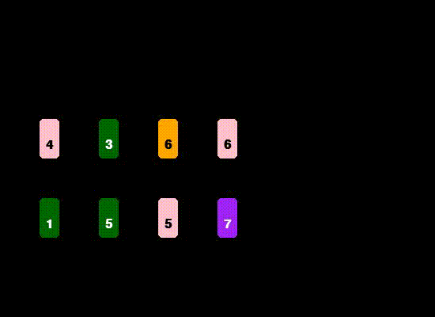

# Reinforcement Learning for Cahoots

This repository contains classes to experiment with [reinforcement learning](https://en.wikipedia.org/wiki/Reinforcement_learning) (RL) for the card game [Cahoots](https://www.whitegoblingames.com/game/cahoots/) using [Gymnasium](https://gymnasium.farama.org) as RL training framework and [pygame](https://www.pygame.org/news) for visualising the game.

With the software included, you can train the most basic RL algorithm ([Q-learning](https://gymnasium.farama.org/tutorials/training_agents/blackjack_tutorial/)) on a Cahoots game and experiment with different parameters such as amount of training, agent parameters, etc.




## Quickstart

```
pip install -r requirements.txt
python3 train.py -h
```

This will give you all the options of the training program.

Note that you can also use the Gymnasium environment provided in your own projects. See [Implementation](#Implementation) section below.

**Note**: By default, training is done on exactly the same game instance (sequence of missions and cards) each time. This will overtrain the agent for exactly that specific instance of a game and not for generic game instances. Doing the latter (by specifying ``seed=0``) will probably result in ill performance as the state space is too big to learn the best strategy averaged over thousands of different game combinations.

## Motivation

I recently started to learn about the fundamentals of RL by reading [Reinforcement Learning, Second edition - An Introduction by Sutton & Barto](https://mitpress.mit.edu/9780262039246/reinforcement-learning/) . In order to make learning fun, I also decided to have some hands-on experience with RL libraries.

My end goal is to train an agent that will systematically win Cahoots at an 'expert level' (see next section about a small description of the game).

Obviously, the software in this GitHub is far from that goal as it is just a very first attempt at building a RL setting for the game itself.

I am no expert on RL - I just started in this field so not all of my statements on this page may be correct.

## Cahoots in a nutshell

Cahoots is a co-operative, turn-based, multiplayer card game (you should definitely have this one in your repertoire if you love games :-) ) and the rules of the game can be found [here](https://www.ultraboardgames.com/cahoots/game-rules.php).

In essence, players try to solve a fixed number of missions (the number of missions determine the difficulty setting of the game) by playing colored, numbered cards on a set of four card stacks on the table. Two simple rules determine if a card can be played from the players hand onto a deck:

- a card of any color can be played on a card of any color if they have the same number
- a card of any number can be played on a card with that same number regardless of color.

Missions vary in task, for example:

- all cards on the deck are green
- all sum of the numbers of the green cards equals the sum of the numbers of the purple cards
- etc

The game ends when all missions have been solved (WIN) or the players run out of cards while there are still unsolved missions (LOSE).

## The Cahoots problem in terms of Reinforcement Learning

According to my basic understanding of RL, the Cahoots problem falls into the category of Partially Observable Markov Decision Problems, which is a more difficult category to solve than Fully Observable Markov Decision Problems.

What this means is that the full state of the game is not known at any particular timestamp and that the state at time $t_n$ depends on the history of the states of $t_m$ with $m < n$. This is mainly caused by the closed cards deck.

Another potential issue is that the state space of the game can be quite large (especially compared to simple games such as BlackJack).

In my naivity I ignore all these problems for the time being in this code :-)

## Implementation

### Observation space, action space and reward function

Every RL problem requires modelling of the state space/observation space (I use the term interchangeably here even if they are not), action space and a suitable reward function. The following design decisions have been made:

#### Observation space

The observation space is modelled as what a real player sees:
- four visible mission cards
- top open cards of the four stacks on the table
- four player cards

with suitable identifiers if a (mission) card is not present.

**Note**: the state does not contain the already played cards throughout the game (aka card counting), while this would definitely be something AI could benefit from! As a matter of fact, the rules of the game state that a player can - at any time - go over the stacks of played cards to determine which cards have been played.

#### Action space

Each action that a player can do is pick one card from the hand (four possibilities) and place it on one of the four card stacks. This can be encoded as the 16 valid modes:
- (0): Player Card 0 -> Stack 0
- (1): Player Card 0 -> Stack 1
- ...
- (14): Player Card 3 -> Stack 2
- (15): Player Card 3 -> Stack 3.

Hence, an action is chosen from a discrete, uniform distribution of $n=16$.

**Note**: If an action is chosen, but the resulting action would lead to an invalid move (e.g. prohibited by the rules of the game, or a chosen player card is not available) the action is still considered by the game but the action will result in a negative reward (see next section):

#### Reward function

The reward function is fixed in code (but obviously can be adjusted). By designing the reward function, I took the following advice from the aforementioned book by Sutton & Barto:

> In particular, the reward signal is not the place to impart to the agent prior knowledge about how to achieve what we want it to do. For example, a chess-playing agent should be rewarded only for actually winning, not for achieving subgoals such as taking its opponent's pieces or gaining control of the center of the board. If achieving these sorts of subgoals were rewarded, then the agent might find a way to achieve them without achieving the real goal. For example, it might find a way to take the opponent's pieces even at the cost of losing the game. The reward signal is your way of communicating to the agent *what* you want achieved, not *how* you want it achieved.

I ultimately decided on the following reward function:

| Event | Reward |
|--------|--------|
| Invalid move | -1 |
| Valid move | 0 |
| Mission solved | 100 |
| Game won | 1000 |
| Game lost | -1000 |


### Files

| File | Description |
| ----- | ----------- |
| agent | Implementation of Q-learning algorithm adapted from https://gymnasium.farama.org/tutorials/training_agents/blackjack_tutorial/ |
| cahoots | The game logic of cahoots (can also be used for building a standalone game) |
| cahootsenv | The actual Gymnasium compatible RL Environment which interfaces with the Cahoots class |
| cards | Implements all the game cards |
| colors | Helper class for defining colors |
| missions | Implements all the mission cards |
| play | Try cahoots on the commandline against a bot that only does random moves |
| players | Helper class for players |
| train | Main code for training the agent |
| visuals | Pygame rendering for the game |


